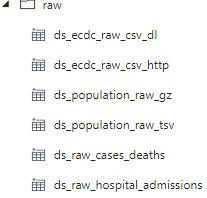
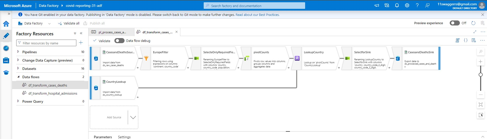
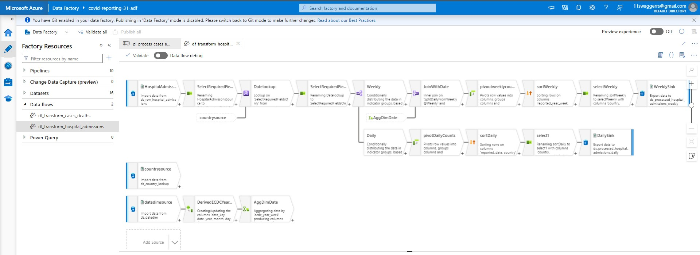
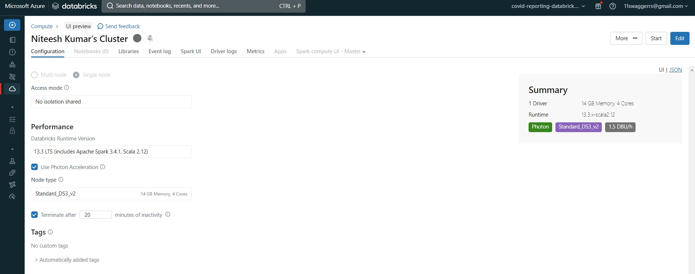
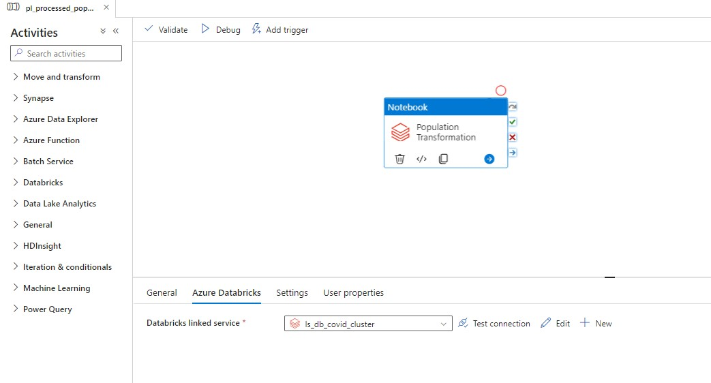
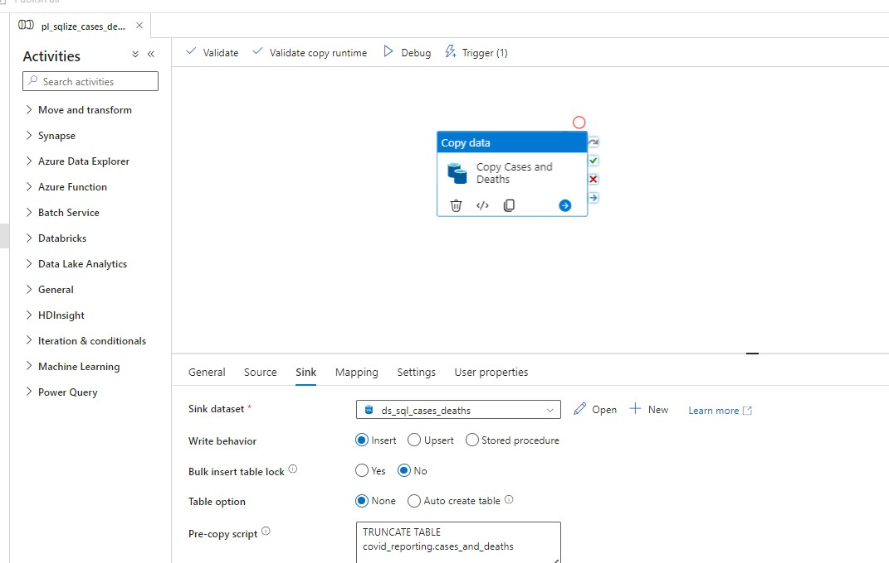
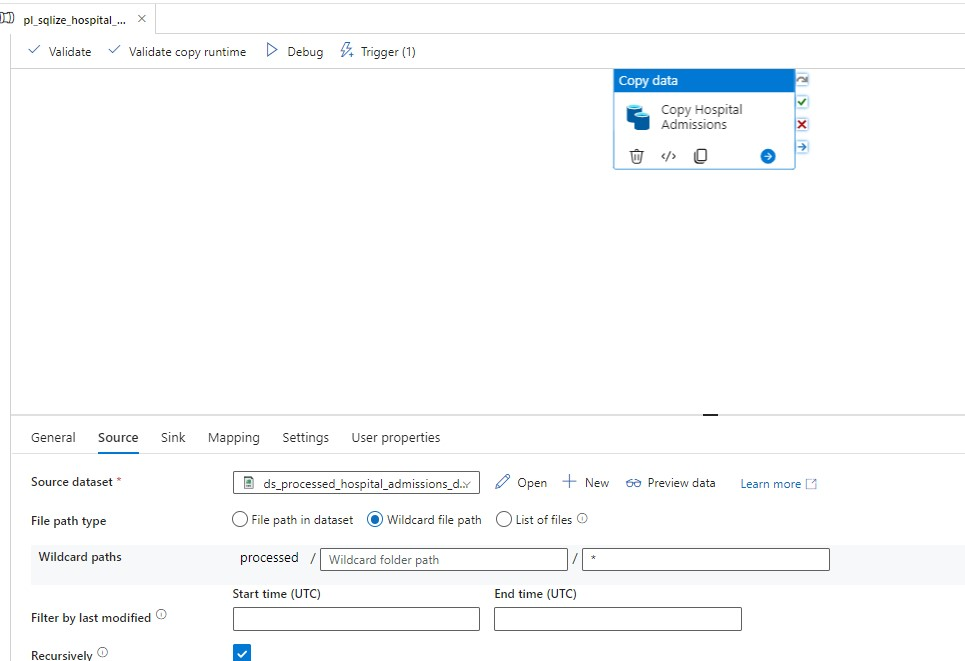
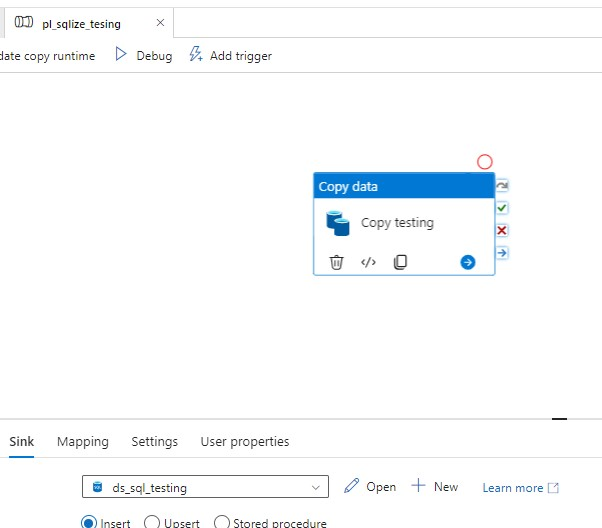
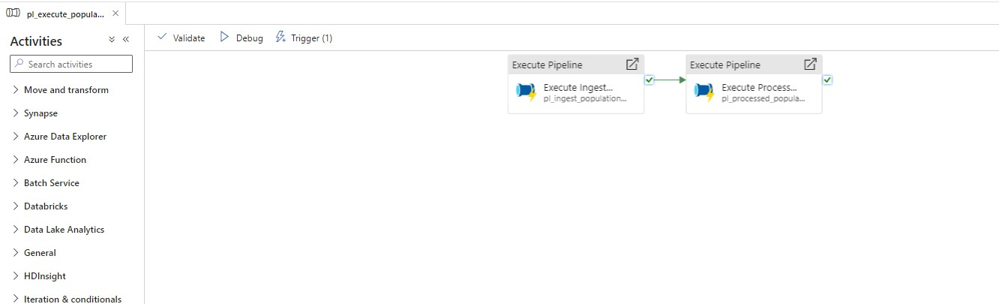
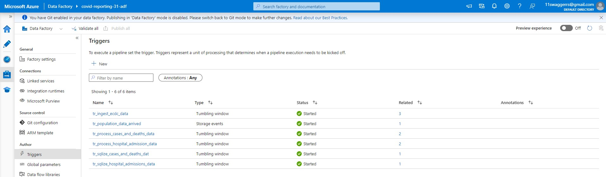

# Covid-19 Reporting

### Project Overview
The project that we're developing now will be based around reporting and prediction of covid-19 spread. The project has mainly two objectives,
1. We will be creating a data platform for datascience team to make use of the final data to build machine learning models to predict the covid-19 spread and other insights of the data.
2. A data platform where our data analyts can easily report on the covid-19 trends using a reporting tool(PowerBI).

### Tools
We will be using azure for most part of the project.
- Azure Data Factory
- Azure Databricks
- Azure CI/CD
- Azure SQL Database
- Azure Storage Solutions
- Azure HDInsight
- Power BI

#### Objective1
- Datalake will be built with the following data to aid data scientists to predict the covid-19 spread and other insights of the data. The data lake comprises of
  
  1. Confirmed cases
  2. Mortality
  3. Hospitalization/ ICU Cases
  4. Testing Numbers
  5. Country's population by age group

#### Objective2
- Data warehouse will be built with the following data to aid reporting on trends.
  1. Confirmed cases
  2. Mortality
  3. Hospitalization/ ICU Cases
  4. Testing Numbers

### Solution Architecture


### Environment Setup

- Create a Azure acccount using Azure portal.
- Create a resource group to have all the required services at one place.
- Create and configure Storagee Account(Blob Storage and ADLS GEN2).
- Create and configure Azure Datafactory.
- Create and configure Azure SQL Database.
- Create and configure Azure Databricks workspace.
- Create and configure Azure HD Insight.
- Create and configure Azure CI/CD.
- Download and configure Power BI using Azure SQL Database credentials.


- We will be Dividing our project into 3 parts:

  1. Data Ingestion
  2. Data Transformation 
  3. Data Loading and Reporting

### Data Ingestion


- As part of data ingestion we will be making use of Azure Datafactory.
 1. We will create a Linked service across ADF, ADLS and ADF, HTTP to fetch input files.
    
  

 2. Create Source and Sink Datasets.
    


 3. Create a pipeline, add copy data activity and configure source and sink data sets.
    


    
 4. Publish all the changes and Debug the pipeline to check everything is workig as expected.
 5. Check and Validate the file in ADLS Cotainer.
    


### Data Transformation

- As we have all the required input files in our ADLS GEN2, we will now transform it to make more meaninfull.
- as part of tranformation we will be using 3 services
  1. Azure Datafactory(Dataflows)
  2. Azure HD Insight
  3. Azure Databricks
     
#### Azure Datafactory(Dataflows)

##### Transforming Cases and Deaths

- Any Dataflow will require two must have objects of Source and Sink tranformations.
- Fetch raw cases and deaths file using source object.
- Make sure to enable dataflow debug before you run the dataflows.
- Filter only the Europe data using Filter object.
- Select only the required fields and rename the columns to make it more meaningfull.
- Convert Indicator and daily count to singe column using pivot
- Add few more columns required using country source dataset and lookup object.
- Select only the requried fields.
- Push the final transformed data into Processed container of ADLS GEN2
- Create a pipeline using the dataflow, create trigger and add to the pipeline, publish all the changes.
- Validate the data in ADLS GEN2 container
 


##### Transforming Hospital Admissions 

- Fetch the raw hospital admissions data file using source object.
- Select only required columns and rename if any.
- Add county info through country looking using lookup object and remove columns which are not required using select.
- Split the data into weekly and daily streams using conditional split object.
- Create a new year week column through dim date file using derived data object.
- Create Week start and end dates using Aggregate object.
- Join the weekly object and aggregate object to have weekly data in one place.
- Do a pivot on both daily and weekly flows using Indicator and value fields(just like we did in cases and deaths transformation)
- Sort the data in country ascending and reported week descending for better view.
- Push the final transformed data into Processed container of ADLS GEN2
- Create a pipeline using the dataflow, create trigger and add to the pipeline, publish all the changes.
- Validate the data in ADLS GEN2 container



#### Transforming population file using Azure Databricks

- Create a Azure databricks workspace and create a cluster.



- Our data is in ADLS, in order to access it we need to mount the storage accounts. Below is the example code.
- Create a service principle using Microsoft Infra ID and fetch client_id,tenant_id,client_secret from ADLS and store them inside Azure keyvalut.
- Assign ```Storage Blob Contributor``` role to the service principle.
- save the secrets in variables and make use of them while mounting.

```
storage_acct_key = dbutils.secrets.get(scope = 'covid19-reporting-scope', key= 'covidreporting31dl-acct-key')
client_id = dbutils.secrets.get(scope = 'covid19-reporting-scope', key= 'covidreporting31dl-app-id')
tenant_id = dbutils.secrets.get(scope = 'covid19-reporting-scope', key= 'covidreporting31dl-tenent-id')
client_secret = dbutils.secrets.get(scope = 'covid19-reporting-scope', key= 'covidreporting31dl-client-secret')

# COMMAND ----------

configs = {"fs.azure.account.auth.type": "OAuth",
           "fs.azure.account.oauth.provider.type": "org.apache.hadoop.fs.azurebfs.oauth2.ClientCredsTokenProvider",
           "fs.azure.account.oauth2.client.id": f"{client_id}",
           "fs.azure.account.oauth2.client.secret": f"{client_secret}",
           "fs.azure.account.oauth2.client.endpoint": f"https://login.microsoftonline.com/{tenant_id}/oauth2/token"}
dbutils.fs.mount(
  source = "abfss://raw@covidreporting31dl.dfs.core.windows.net/",
  mount_point = "/mnt/covidreporting31dl/raw",
  extra_configs = configs)
```
- I created mount point for RAW container above, likewise do it for processed and lookup containers.
- Please refer to the ```transform_population_data.py ``` in my pyspark notebook folder for Transformation of data.
- Create a pipeline and trigger it and validate the data in processed folder.



### Data Ingestion or Load

#### Ingest Data into Azure SQL database for PowerBI reporting
- As we perfomed all the required transformations, we're ready for reporting!!
- We will load our processed data into Azure SQL database, we will make connection among SQL database and PowerBI.
- Create tables required using ```files/create_covid_tables_ddl.sql``` scripts.
- Create a pipeline and add processed cases and deaths file as source.
- create sink dataset using Azure SQL database service principle.
- Debug the pipeline and validate data in  Azure SQL database tables.
- Create seperate pipeline for Hospital admissions and Testing files and validate the data in tables.
  







### Making pipelines Production Ready
- In real world projects, piplines will be made to run automatic using either schedules or through other depencies.
- We will now create a dependency pipeline for population end-end processing.
- This pipeline will trigger databricks transformation pipeline only when the ingestion pipeline gets completed successfully.



- We will create Tumbling window triggers for ECDC data transformation.
- Create triggers for all the 5 pipelines and add dependencies across ingest and transform pipelines.




### Usefull Links for this Project

- ECDC Website for Covid-19 Data - https://www.ecdc.europa.eu/en/covid-19/data
- Euro Stat Website for Population Data - https://ec.europa.eu/eurostat/estat-navtree-portlet-prod/BulkDownloadListing?file=data/tps00010.tsv.gz
- Introduction to Azure Storage services - https://docs.microsoft.com/en-us/azure/storage/common/storage-introduction
- Azure SQL Database - https://docs.microsoft.com/en-us/azure/azure-sql/database/sql-database-paas-overview
- Azure Synapse Analytics - https://docs.microsoft.com/en-us/azure/synapse-analytics/overview-what-is
- Azure Cosmos DB - https://docs.microsoft.com/en-us/azure/cosmos-db/introduction
- Azure Data Lake Storage Gen2 - https://docs.microsoft.com/en-us/azure/storage/blobs/data-lake-storage-introduction


