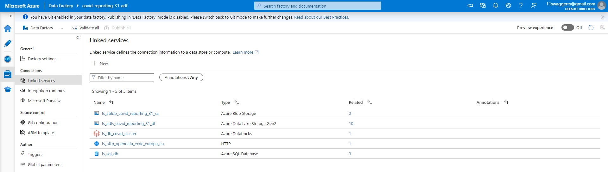
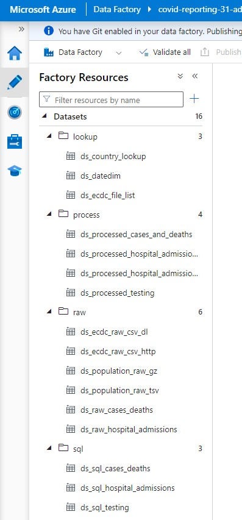
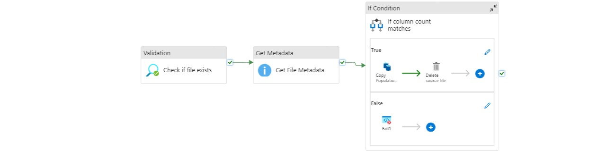
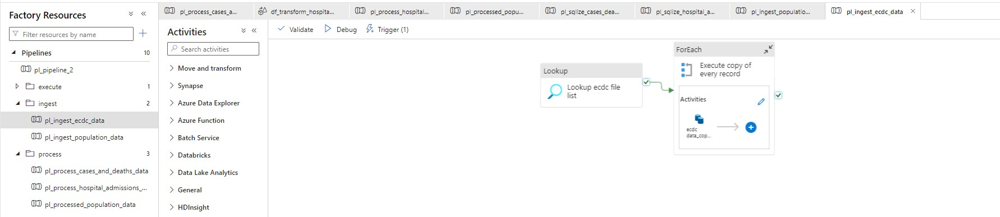
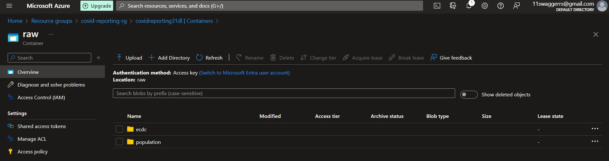

# Covid-19 Reporting

### Project Overview
The project that we're developing now will be based around reporting and prediction of covid-19 spread. The project has mainly to objectives,
- We will be creating a data platform for datascience team to make use of the final data to build machine learning models to predict the covid-19 spread and other insights of the data.
- We will be creating a data platform where our data analyts can easily report on the covid-19 trends on a reporting tool.

### Tools
We will be using azure for most part of the project.
- Azure Data Factory
- Azure Databricks
- Azure CI/CD
- Azure SQL Database
- Azure Storage Solutions
- Azure HDInsight
- Power BI

#### Objective1
- Datalake will be built with the following data to aid data scientists to predict the covid-19 spread and other insights of the data. The data lake comprises of
  
  1. Confirmed cases
  2. Mortality
  3. Hospitalization/ ICU Cases
  4. Testing Numbers
  5. Country's population by age group

#### Objective2
- Data warehouse will be built with the following data to aid reporting on trends.
  1. Confirmed cases
  2. Mortality
  3. Hospitalization/ ICU Cases
  4. Testing Numbers

### Solution Architecture

### Environment Setup

- Create a Azure acccount using Azure portal.
- Create a resource group to have all the required services at one place
- Create and configure Storagee Account(Blob Storage and ADLS GEN2)
- Create and configure Azure Datafactory
- Create and configure Azure SQL Database
- Create and configure Azure Databricks workspace
- Create and configure Azure HD Insight
- Create and configure Azure CI/CD
- Download and configure Power BI using Azure SQL Database

- We will be Dividing our project into 3 parts:

  1. Data Ingestion
  2. Data Transformation 
  3. Data Loading and Reporting

### Data Ingestion

- As part of data ingestion we will be making use of Azure Datafactory.
 1. We will create a Linked service across ADF, ADLS and ADF, HTTP to fetch input files.
    
  

 2. Create Source and Sink Datasets.
    
 

 3. Create a pipeline, add copy data activity and configure source and sink data sets.
    

    
 4. Publish all the changes and Debug the pipeline to check everything is workig as expected.
 5. Check and Validate the file in ADLS Cotainer.
    

### Usefull Links for this Project

- ECDC Website for Covid-19 Data - https://www.ecdc.europa.eu/en/covid-19/data
- Euro Stat Website for Population Data - https://ec.europa.eu/eurostat/estat-navtree-portlet-prod/BulkDownloadListing?file=data/tps00010.tsv.gz
- Introduction to Azure Storage services - https://docs.microsoft.com/en-us/azure/storage/common/storage-introduction
- Azure SQL Database - https://docs.microsoft.com/en-us/azure/azure-sql/database/sql-database-paas-overview
- Azure Synapse Analytics - https://docs.microsoft.com/en-us/azure/synapse-analytics/overview-what-is
- Azure Cosmos DB - https://docs.microsoft.com/en-us/azure/cosmos-db/introduction
- Azure Data Lake Storage Gen2 - https://docs.microsoft.com/en-us/azure/storage/blobs/data-lake-storage-introduction

